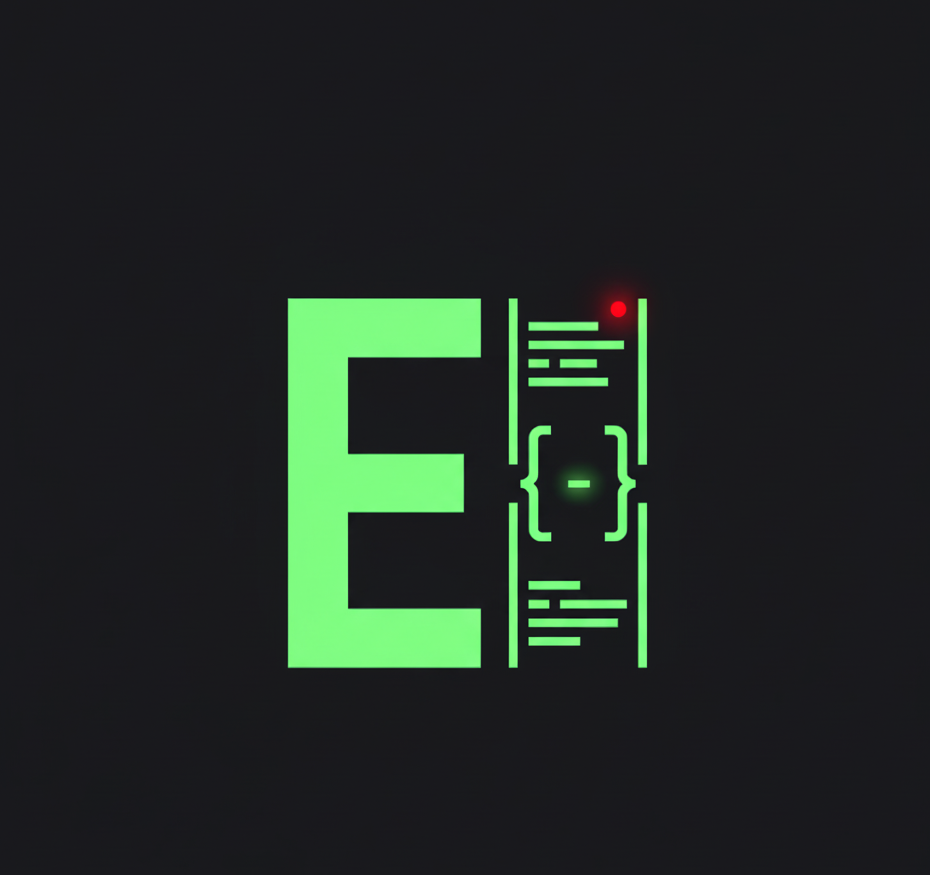

  
  <h1>EasyTerminal</h1>
  

    <strong>An All-in-One, Multi-Protocol Remote Control Center</strong>
  

  

    Designed for Developers, System Administrators, and Tech Enthusiasts.
  

  
  <h4><a href="https://easyterminal.netlify.app/">Visit the Official Website</a></h4>

  

## 🚀 About The Project

EasyTerminal is more than just a terminal. It's an integrated control center built with Python and Tkinter, providing everything you need to manage remote servers and devices. By combining a terminal, an SFTP file manager, and a monitoring dashboard into a single application, EasyTerminal aims to streamline your workflow and boost productivity.

This application was born from the need for a tool that is fast, secure, and feature-rich, eliminating the need to switch between multiple apps.

## ✨ Key Features

EasyTerminal is packed with advanced features to provide a superior remote management experience:

#### 1. Multi-Protocol Support
- **SSH:** Full interactive terminal, SFTP file management, and command execution.
- **Telnet:** Basic connectivity for legacy devices and internal networks.
- **FTP/FTPS:** A complete file manager for FTP servers, with support for secure connections (FTPS).
- **Serial (COM):** Connect directly to hardware like microcontrollers or network devices via a serial port.

#### 2. Powerful SSH & SFTP Suite
- **Dual-Pane File Manager:** Effortlessly manage local and remote files side-by-side.
- **Full File Operations:** Upload, download, rename, delete, and create new files and folders.
- **Real-Time Server Monitoring:** Keep an eye on your server's CPU, RAM, Temperature, and Disk usage directly from the UI.
- **Intelligent Recycle Bin:** Safely delete remote files! Instead of being permanently erased, files are moved to a local recycle bin on your computer.
- **Integrated Nano-Style Text Editor:** Edit files on the server directly from EasyTerminal using a familiar `nano`-like editor without opening a separate terminal.
- **Remote Image Viewer:** Preview images on the server without needing to download them first.

#### 3. Centralized Management
- **Connection Manager:** Securely save, manage, and group all your connection details.
- **Head-Command:** Execute a single command across all active SSH sessions simultaneously—perfect for bulk updates or status checks.
- **Session Restore:** The app remembers your active sessions and offers to restore them on startup.
- **Automatic Idle Mode:** Inactive sessions enter a low-resource state to keep the application running smoothly.

#### 4. Security Focused
- **Local Credential Encryption:** All saved hosts, usernames, and passwords are encrypted locally on your machine using **AES-GCM**, keeping them safe from unauthorized access.

## 🛠️ Built With

* **Python:** The core language of development.
* **Tkinter:** For the native and responsive Graphical User Interface (GUI).
* **Paramiko:** The primary library for SSH and SFTP protocol implementation.
* **Pillow (PIL):** Powers the remote image viewer feature.
* **Pyserial:** Enables Serial (COM) port functionality.
* **Cryptography:** Ensures the secure encryption of user credentials.

## 🏁 Getting Started

Getting EasyTerminal up and running is simple. The application is distributed as a standalone executable for ease of use.

1.  **Navigate** to the **[Official Website](https://easyterminal.netlify.app/)**.
2.  **Download** the latest `.exe` release for Windows from the downloads section.
3.  **Run** the executable. No complex installation required!

## 🤝 Contributing

**Contributions are what make the open-source community such an amazing place to learn, inspire, and create. Any contributions you make are greatly appreciated.**

Currently, EasyTerminal is developed and maintained by a single person. As a **solo developer from Indonesia**, I built this project out of a passion for creating useful tools. I would be thrilled to have other developers join in to make it even better.

Your help, whether in the form of:
* New Features
* Bug Reports
* Suggestions & Ideas
* Documentation Improvements

would mean the world. Please feel free to Fork the repo and create a Pull Request!

1.  Fork the Project
2.  Create your Feature Branch (`git checkout -b feature/AmazingFeature`)
3.  Commit your Changes (`git commit -m 'Add some AmazingFeature'`)
4.  Push to the Branch (`git push origin feature/AmazingFeature`)
5.  Open a Pull Request

## 📄 License

Distributed under the MIT License. See `LICENSE` for more information.

## 📬 Contact

**EasyTerminal Official**

* **GitHub:** [https://github.com/EasyTerminalOfficial](https://github.com/EasyTerminalOfficial)
* **Website:** [https://easyterminal.netlify.app/](https://easyterminal.netlify.app/)
* **Telegram:** [https://t.me/EasyTerminalUpdate](https://t.me/EasyTerminalUpdate)

---
Made with ❤️ in Indonesia.
